# Web instituto Ugarte

Este producto digital consiste en diseñar una web móvil a un instituto de cosmiatria, para incrementar su prestigio, agilizar procesos de inscripción, matrícula y pago. Se desarrollaron diversas actividades de investigación para identificar necesidades de los usuarios.

## Desarollado para
[Laboratoria](http://www.laboratoria.la/)

## Contexto

El instituto Ugarte se encarga de   brindar estudios especializados en el área de cosmiatría y esteticismo a diversas personas, según sean sus intereses. Cuentan  con una  excelente plana docente, infraestructura y tecnología moderna la cual permite brindar certificación y título con el respaldo del Ministerio de Educación, logrando profesionales calificados para el exigente mercado laboral.

Por el momento el instituto cuenta con una Fanpage en facebook, por la cual tiene contacto con su público en general, pero debido a su reciente crecimiento está optando por tener un sitio web. 

En el  instituto  muchos de los procesos los realizan de manera presencial y desean pasar alguno de estos procesos a una página web.

### Objetivos de la empresa

* Generar mayor confianza  con su alumnado.

* Incrementar  su alumnado.

* Ser reconocida como la mejor Institución Educativa en cosmiatría y esteticismo a Nivel Nacional.

## Idea de Negocio

Una web del instituto Ugarte que da la facilidad de inscribirse, matricularse y pagar  de manera online a las diversas carreras, cursos y talleres de la institución.

## Stakeholders

* Alumnos

* Gerente general de la institución

* Gerente de marketing

* UX/UI designer

## Reunión kick-off

Se realizó una entrevista  al gerente general del instituto, .para conocer sus principales necesidades y entender que objetivos quiere cumplir con la web de la institución

* ¿Cuál es el modelo de negocio de la empresa?¿ cuales son los productos o servicios?

Una de las actividades en las que se desarrolla instituto Ugarte es la formación de profesional técnico de cosmiatria y esteticismo, la capacitación y dictado de cursos por modulos, aprte se dictan cursos externos con horarios flexibles, que se ajustan a lo que necesita el alumnado.

* ¿Quiénes son sus clientes? Publico objetivo

Egresados de las diferentes instituciones educativas, así como cualquier entusiasta interesado en querer el rubro de la cosmiatria y el esteticismo

* ¿Posee algún tipo de presencia online? Redes sociales, sitio web

Se tiene una fanpage en facebook, pero lo de malo es cuadno hacemos la publicaciónes de algun curso o evento , estás van bajando y desapareciendo del muro principal. Lo que dificulta que el público en general se entere de todo nuestros cursos disponibles a tiempo.

* ¿Quién es su competencia?

Institutos locales, en especial el Instituto Roosvelt

* ¿Quiénes son sus stakeholders?

empresas que distribuyen cosméticos de belleza, así como las que proporcionan equipos de tratamiento, plana docente calificado, staff administrativo, clientes varios, estudiantes.

* ¿Por qué crear un sitio web ahora?

  * Por el incremento de la demanda de alumnos.

  * Para que el alumno no tenga la necesidad de acercarse a la institución.

  * Para entrar a la era de la tecnoligía.

  * Para que el personal que tiene como tarea matricular e inscribir  tenga otras funcionalidades.

* ¿Cuáles son las ventajas o desventajas de la creación pagina web?

Ventaja: mayor difusión de la empresa, asi como de los servicios que esta proporciona

Desventaja : poco acercamiento con el publico objetivo.

* ¿Qué tiene la competencia que nosotros queremos?

Poder contar con aula virtual en futuro próximo.

* ¿Qué espera obtener con la pagina web?

Que mayor gente elija corporación Ugarte como institución de formación profesional técnica.

* ¿Cómo es el proceso de matrícula e inscripción actualmente?

El proceso de matricula e inscripción se realiza de la siguiente manera:

  * El alumno se acerca hasta la institución y después a un respectivo banco donde realiza el pago.

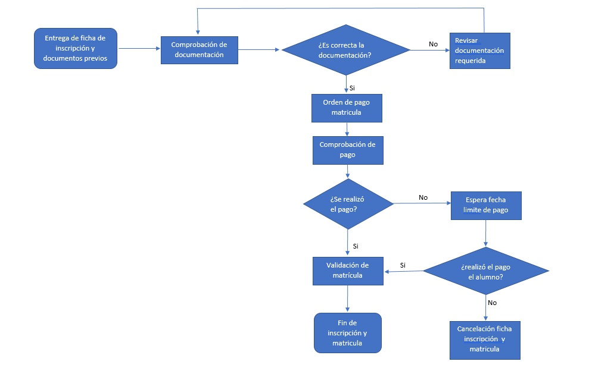

## Recopilación y análisis de datos

### Encuestas online

Se realizó  encuestas online a 26 alumnas que actualmente estudian en el instituto, para tener un mayor panorama de lo que desean tener con la web.

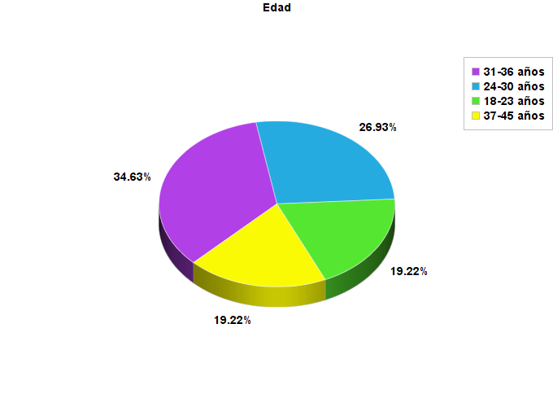 
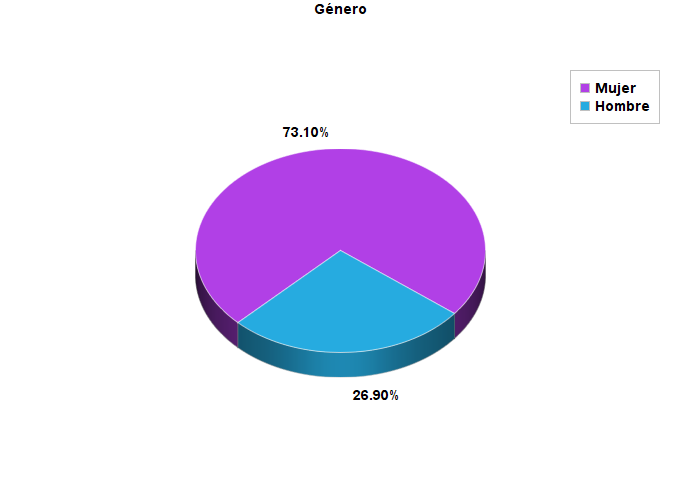 
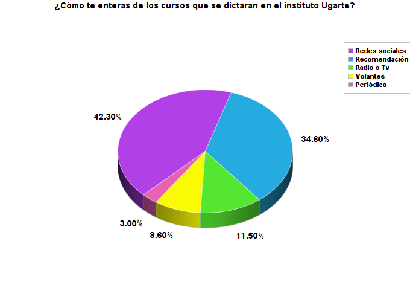 
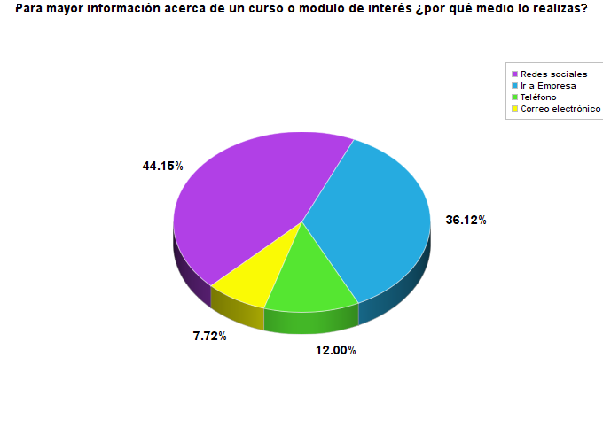 
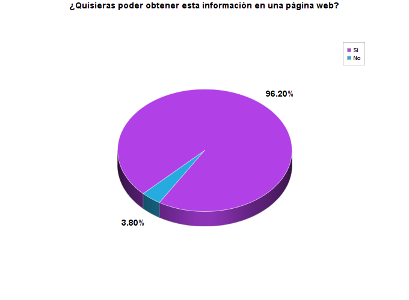 
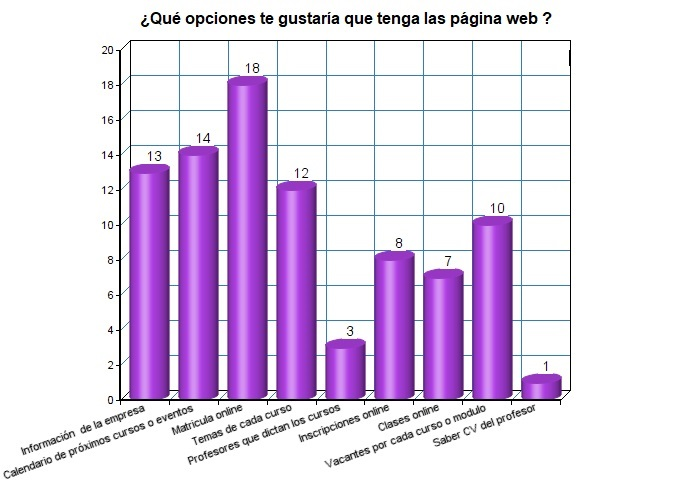 
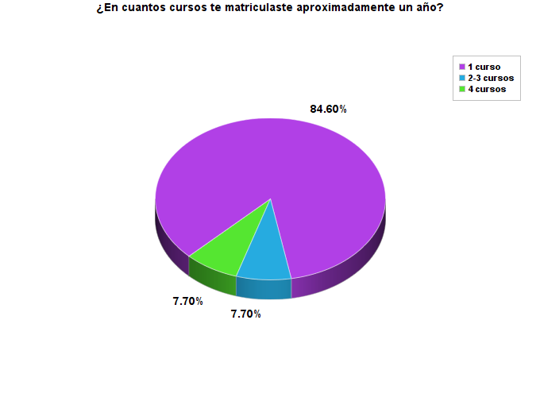
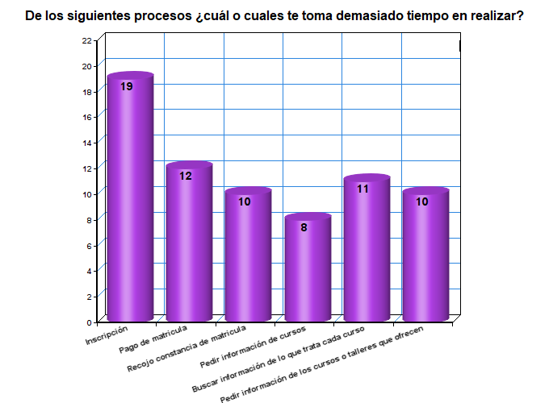

Enlace de encuestas: https://goo.gl/forms/y6h6IxIMicWp8EJg1

### Entrevistas

Se realizo 2 entrevistas presenciales a las alumnas de la institución, para conocer qué es lo  que ellas  desearían tener  en una página web, si la usarían y sobre todo satisfaga sus necesidades. 

#### Susana Ramirez  27 años

  * ¿Cómo te enteras de los cursos que dictan en el instituto Ugarte?

    Algunas veces me  entero por su Facebook, o sino los profesores informan de que cursos o talleres estarán disponibles el siguiente mes.

  * Para más información acerca de la carrera, o curso de interés ¿Por qué medio lo realizas?

    Por su Facebook, o me acerco a la oficina de atención  al alumno  para que me den mayor información.

  * ¿Quisieras poder obtener esta información  en una página web?

    Hay si, aunque tendría que aprender a usarla pero me ayudaría bastante porque yo vivo lejos del instituto y venir para hacer algún papel se me hace engorroso.

  * ¿Qué opciones te gustaría que tenga la página web?

      - Los cursos disponibles  o próximos cursos.
      - La cantidad de vacantes que quedan disponibles por cada curso.
      - Horarios y precios

  * ¿Qué procesos que realizas en la universidad  te toma más tiempo realizar?

    - El de averiguar de qué trata cada curso.

    - El de tener que ir a pagar a un banco la matricula.

#### Luana Rodriguez  29 años

* ¿Cómo te enteras de los cursos que dictan en el instituto Ugarte?

    Por los profesores que informan de que cursos o talleres estarán disponibles el siguiente mes, o si no hay un mural donde colocan diversas noticas y ahí ponen los cursos habilitados.

  * Para más información acerca de la carrera, o curso de interés ¿Por qué medio lo realizas?

    Escribo un correo electrónico para que me envíen  toda la información.

  * ¿Quisieras poder obtener esta información  en una página web?

    Por supuesto que si, varias instituciones la tiene  y a esta le estaba faltando, solo tiene el Facebook, pero a veces demoran en responder  algunas dudas  

  * ¿Qué opciones te gustaría que tenga la página web?

      - Que tenga los pagos online.
      - Testimonios de alumnas que ya estudiaron en el instituto.
      - Horarios y precios

  * ¿Qué procesos que realizas en la universidad  te toma más tiempo realizar?

    - Todo el papeleo de inscribirse a un nuevo curso o taller, pese  a que mis datos ya estan guardados en su   base de datos, siempre tengo q ir a hacer lo mismo .

    - Saber que cursoss dictarán mas adelante.

### Benchmarck

  Se toma como  referencias a otros institutos que ya cuentan con matrícula, inscripcion y pago online.

  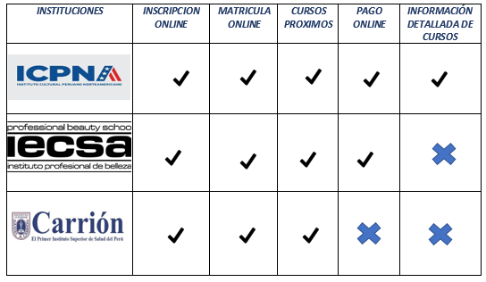 

#### Conclusiones Benchmarking

* Después de la investigación se encontró que el instituto Ugarte tienes muchos procesos presenciales a comparación de las instituciones con las que se realizó benchmarck.

* El instituto Icpna es la única institución que tiene sus procesos automatizados, y cuenta con una muy buena información detallada de los cursos que ofrece.

## Síntesis y definición

### Affinity map

### User person

### User flow

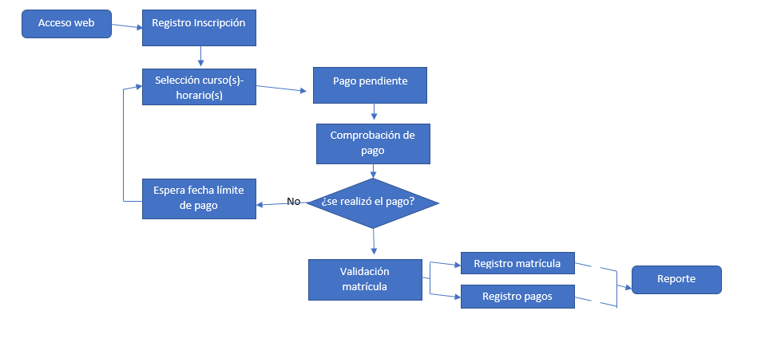

## Ideación

### Feature List

## Prototyping

### Prototipo en papel

Se testeó a 3 usarios, tomamos en cuenta sus observaciones para realizar un mejor prototipo digital

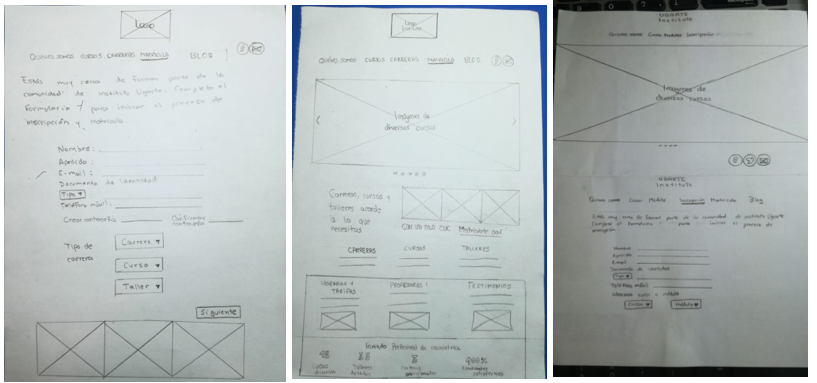

Alumnos que testearon el prototipo en papel

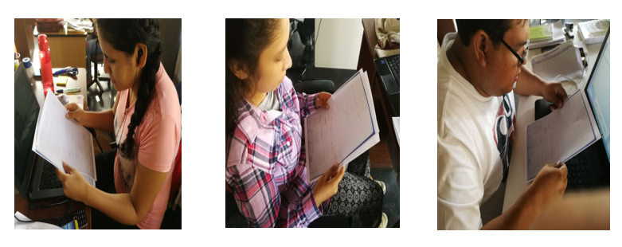

  * Conclusiones

    * Uno de los usuarion no entendio bien la parte de elegir curso, carrera o taller, penso que se tenia que elegir los tres al mismo tiempo.

    * Las tres personas testeadas prefieren siempre ver mas gráficos que texto.

    * Tiene que ser mas claro el flujo de pago, dudaron como realizarlo.

    * Debe de haber un aviso o alerta que informe en que curso se matriculo el alumno despues de haber realizado todo el proceso.

    * Que siempre sugieran los cursos que habrá mas adelante.

    * Que la información de pago mejor sea enviada a su correo.

### Prototipo alta fidelidad

  Se logro testear a 3 alumnos, los cuales nos dieron importantes observaciones así como también a varios les gusto el producto final. 

  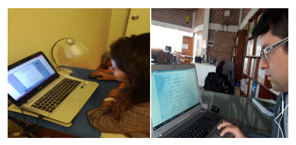

  https://marvelapp.com/42ji1c6

  * Conclusiones

    * Los colores de las letras del pie de página deberían de combinar con el entorno de la página web, por todo lo demás, esta fácil de moverse por la página web. 

    * Es satisfactorio saber que la inscripción y matrícula ya se pueden realizar mediante la página web; es bueno también encontrar información de los distintos cursos que se dictan. Una de las cosas que me dejo muy emocionado es que ya se puede pagar con tarjeta, en definitiva, es lo mejor de todo.

    * La página muestra cada sección de forma muy sencilla y vistosa, con información necesaria que me permite guiarme por toda la web.

    * La combinación de colores es apropiada, no se ve recargado, me gustaría más si tuviese alguna animación o video.

